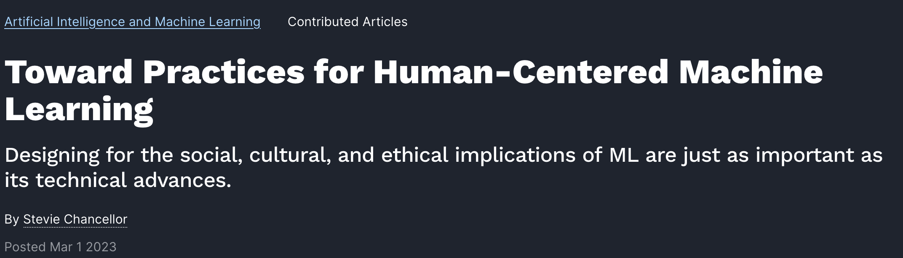
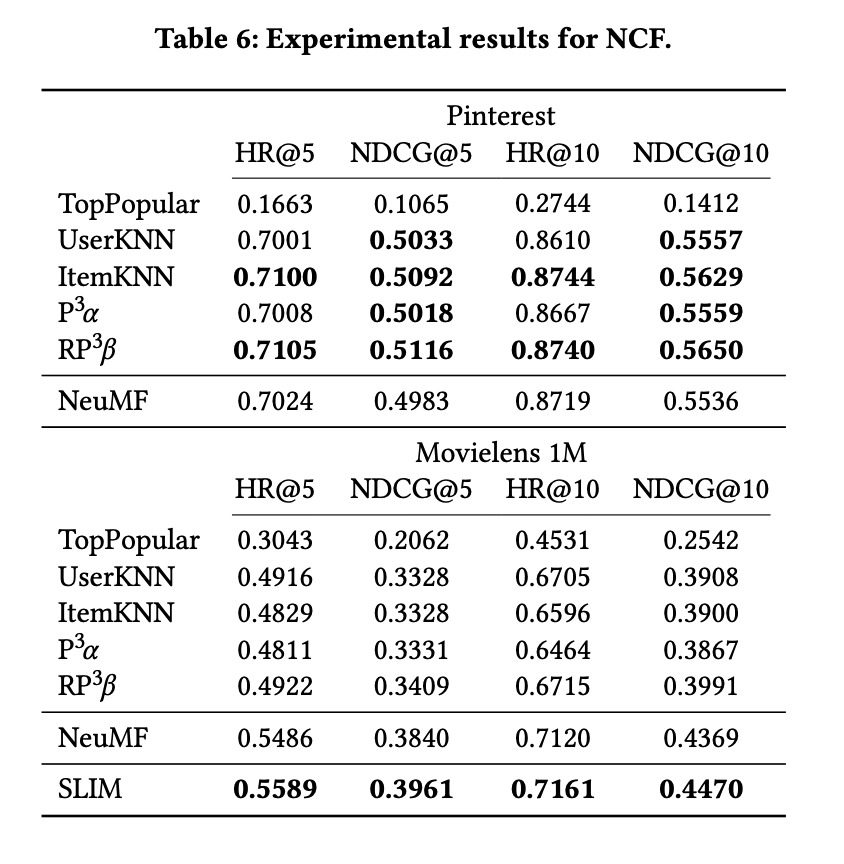
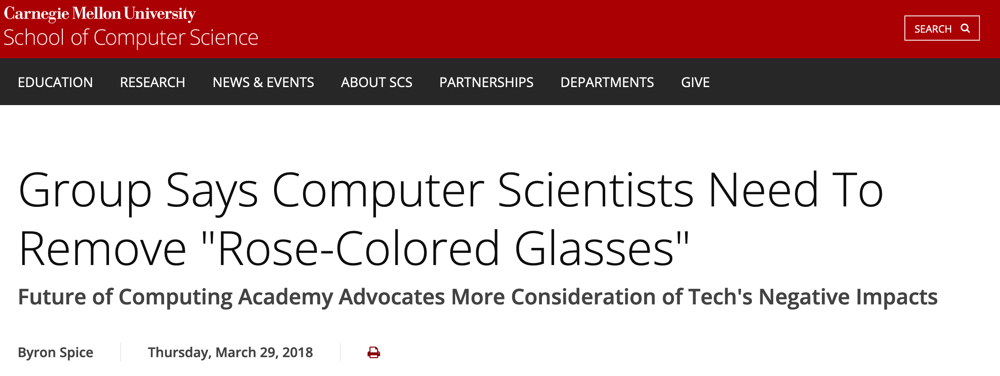
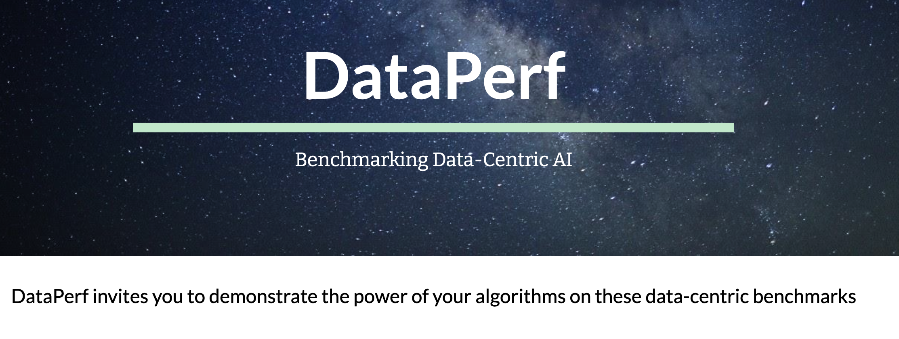

# Week 2: Human-centered and Data-centric Machine Learning 

About: This deck contains lecture content for Jan 14, 2025 and Jan 16, 2025.

---

# While we file in

<v-clicks>

- Reminder: join Discord (I will do quick thought dump on how I think we'll use it)
- Anyone have AI-related news they want to discuss?
- Feel free to collect your thoughts re: strong reactions to readings
  - Skim them again to reload into short term memory

</v-clicks>

---

# Course Logistics

<v-clicks>

- Slides will go on GitHub
- Submit reading response by Wed. this week (or email me if you just joined)
- New readings posted

</v-clicks>

---

# Today's Agenda

<v-clicks>

- Today: Discuss readings for this week
- Repeating some remarks on "What's the point of Module 1"
- Goals: highlight key takeaways, find areas of interest
- At the end: segue to readings for next week

</v-clicks>

---

Some exciting Late Breaking Links

---

# HCML Reading (Chancellor 2023)

(screenshot from https://cacm.acm.org/research/toward-practices-for-human-centered-machine-learning/)

---

# Good and bad uses of AI -- some go to examples

<v-clicks>

## Good?

- Auto complete
- Predict malignant tumor

## Bad?

- Deep fake
- Discrimination (on many axes)

Let's add some more to the board.

</v-clicks>

---

# Progress? in AI

  

  <v-clicks>
  
  - Deep learning "gains" don't always hold up to scrutinty
  -  One example on the right (screenshot from Maurizio Ferrari Dacrema, Paolo Cremonesi, and Dietmar Jannach. 2019. Are we really making much progress? A worrying analysis of recent neural recommendation approaches. In Proceedings of the 13th ACM Conference on Recommender Systems (RecSys '19). Association for Computing Machinery, New York, NY, USA, 101–109. https://doi.org/10.1145/3298689.3347058)

  </v-clicks>

  

  

  <v-clicks>
  
  </v-clicks>
  

---

## Some concrete examples of ML -> HCML

- change an algorithm so it advances some fairness objective
- taking a system that's "closed off" and adding a human-in-the-loop component
  - side note: Who's taken control theory?
- taking a system that just does input -> output mapping and adding a "human-AI collaboration" feature
- taking an existing system and doing analysis that reveals social impacts

---

## Being more thoughtful about people as "objects of prediction"

One of Nick's favorite toy examples: going from geological prediction to guessing your favorite movie...

<v-clicks>

- How to counter this?
  - Fairness, equality, justice
- Note: computing often forces us to precisely define these concepts in a way that's illuminating
- We might disagree!
  - Pause for first round of disagreement! (use whiteboard)

</v-clicks>

---

## What exactly is HCML

- Everybody has their take. There's at least 3 other options...

> 11. Chancellor, S. Baumer, E.P.S., and De Choudhury, M. Who is the "human" in human-centered machine learning: The case of predicting mental health from social media. PACM-HCI 3, Nov. 2019.
> 44. Shneiderman, B. Human-centered artificial intelligence: Reliable, safe and tustworthy. Intern. J. Human-Computer Interaction 36, 6 (2020), 495–504; https://doi.org/10.1080/10447318.2020.1741118
> 47. Vaughan, J.W. and Wallach, H. A Human-Centered Agenda for Intelligible Machine Learning.

(from Chancellor 2023 references; We're reading Ref 44 this week!)

---

## Practice Q1 (easy)

Which best describes a critical aspect of problem formulation in HCML?

- Using the research ethics board to handle ethical considerations
- Focus primarily on gathering as much human data as possible
- Assess if ML is an appropriate solution to a problem
- Use ML as the first step in problem-solving workflow

---

## Practice Q2 (moderate)

Give an example of an "AI" (broadly construed) feature that's been deployed to a major platform like Instagram, Google, etc. Then, provide one example of how an HCML approach might be used to change that feature.

---

# Sub-fields of CS

Article mentions we should "refine HCML into a unifying and interdisciplinary force across CS rather than risk fracture with each sub-field of CS taking ownership of an independent vision of HCML"

What's the backstory here?

---

# A bit of behind the scenes into CS research

<v-clicks>

- Subcommunities often run their own conferences
- Drives a lot of the incentives of researchers
- This might matter for research-related jobs in industry too
  - e.g., some ML jobs list NeurIps papers as a requirement, some Responsible AI jobs list FAccT

</v-clicks>

---

# Examples

<v-clicks>

- ML people send papers to NeurIPS, ICML, ICLR, and many more
  - but sometimes the ML conference has a human-centered workshop
- HCI people send papers to CHI, CSCW, and many more
  - sometimes the HCI conference has an ML workshop
- Philosophy people send papers to their own journals

</v-clicks>

---

# Early HCML

<v-clicks>

- Chancellor highlights some of the history -- the "HCI" community and "FAccT" community played major roles
  - FAccT is a relatively new conference which has gained a lot of momentum
- [Information Science](https://en.wikipedia.org/wiki/Information_science) and [science and technology studies](https://en.wikipedia.org/wiki/Science_and_technology_studies)
- [Computer supported cooperative work](https://en.wikipedia.org/wiki/Computer-supported_cooperative_work) also plays a major role
- Various social sciences and fields of critical scholarships as well..
- That's a lot of disciplines already!

</v-clicks>

---

# Acronyms you might hear me use

<v-clicks>

- HCI: human-computer interaction. Main conference is "CHI", confusingly.
  - ranges from building entirely new interfaces for computing to large scale analyses of online behavior
- FAccT: Fairness, Accountability, and Transparency
  - ranges from highly technical mathematical definitions of fairness (proofs, bounds, etc.) to big data audits to sociological or legal arguments
- CSCW: computer supported cooperative work (and social computing)
  - ranges from early work on networked cooperation to modern work on e.g. Reddit, Wikipedia, etc.
- STS: Science and technology studies. Sometimes, science, technology, and society
  - incorporates history of technology, philosophy of science

</v-clicks>

---

# What Counts as HCML?

Some approaches to defining HCML

- focus on fairness and justice?
- use of qualitative methods?
- choice of domain, like health?
- taking into account social units?

---
layout: center
---

# Proposed definition statement

 

## "Human-centered machine learning is a set of practices for building, evaluating, deploying, and critiquing ML systems that balances technical innovation with an equivalent focus on human and social concerns."[^1]

[^1]: [Chancellor 2023](https://cacm.acm.org/magazines/2023/3/270209-toward-practices-for-human-centered-machine-learning/fulltext)

---

# We can evaluate different practices to see if they fit in this set

<v-clicks>

- It's possible two different organizations both trying to build an AI system for the same *task* could differ substantially in whether they meet the "human-centered" definition
- People can always disagree about what human and social concerns should be ranked most highly
- But this gives us a starting point

</v-clicks>

---

# Focusing on Practices 

Five categories of suggestions are given, i.e. what can you do when you're a software engineer, manager, research scientist, professor, etc.

<v-clicks>

- should I use ML?
  - Requires developing pretty sophisticated normative positions!
- what's my "position"?[^2]
- don't just think about "users", think about humans and ecosystems
- credit other domains and collaborate with them
  - you probably need a doctor to help with your AI for health start-up
- prepare for and iterate on failure
  - what if your new AI system just doesn't work for a particular language?

</v-clicks>

[^2]: See e.g. [positionality statements](https://en.wikipedia.org/wiki/Positionality_statement)

---

# What challenges might we expect to face?

---

# Institutional actions

<v-clicks>

## new norms at conference

e.g. negative impact statements, e.g. [NeurIPS](https://www.cs.cmu.edu/news/2018/group-says-computer-scientists-need-remove-rose-colored-glasses)

People were mad!

</v-clicks>

---

<v-clicks>

## institutional support for interdisciplinary research
- conferences, grants, programs

## computing (broad) vs. computer science
- broader conception

## support students who want to do interdisciplinary research!
- (I'm trying to take some of the advice from this article in this very class!)

</v-clicks>

---

# Over to DCAI

(screenshot from https://www.dataperf.org/)

- note: you were just asked to read Intro (super quick!). We'll talk through the "testable content" in lecture.

---

# Problems with data

<v-clicks>

- "Differences in labeling": do you and I agree if a pill is "scratched"? Does my hospital notes system have a different coding system than yours?
- "Emphasis on big data": what about a rare medical condition?
- "Ad hoc data curation": need to systemize?

</v-clicks>

---

# Finding label disputes

<v-clicks>

- We might use tools to find subsets of a dataset with high label disputes
- Influence estimation provides one approach (more on this later)
- Key idea: know that data-centric ML might involve being thoughtful about the potential for issues that arise in labeling (don't just take labels as given and iterate on modeling)

</v-clicks>

---

# Domain Expertise

<v-clicks>

- get the biologists to label the cells!
- get former players to provide "labels" for sports analytics
- many more examples
- this is where the DCAI argument really starts to merge with the HCAI argument
- Key idea: know that data-centric ML involves consideration of who labeled your data

</v-clicks>

---

# What is DataPerf

<v-clicks>

- a so-called "benchmark suite"
- focused on data tasks
- meant to be community run and led 

</v-clicks>

---

# What's an "ML benchmark?"

Conventional model-centric ML definition: "a standard, fixed dataset for model accuracy comparisons and performance measurement" (p2, Mazumber et al)

---

# Some terms

<v-clicks>

- from "Probabilistic Machine Learning: An Introduction", Murphy 2022 (https://probml.github.io/pml-book/book1.html)
- task $T$ to learn mapping $f$ from inputs $x \in X$ to outputs $y \in Y$
- x called features (or covariates, or predictors)
- y is label (or target, or response)
- we have N input-output pairs $D = {(x_n, y_n)}$ for $n \in (1,N)$. D is the training set, N is the sample size.

Any questions about this? Have an alternate set of preferred variables from your ML course (we can use those instead!)

</v-clicks>

---

# Comparing model-centric benchmark and data-centric benchmark

<v-clicks>

- in model-centric, we have a fixed dataset $D$ and we try a bunch of different ways to find $f$
- change model architecture, change training hyperparameters, change task metrics
- in data-centric, we keep all these fixed and just change $D$

</v-clicks>

---

Practice Q3 (easy)

Which best describes the primary goal of DataPerf?

- To focus solely on improving computational power
- To benchmark AI algorithms for efficiency
- To provide a benchmark suite for evaluating ML datasets and data-centric algorithms
- To develop new machine learning models

---

# Testable concept: is a benchmark data centric

<v-clicks>

- you might imagine a test question that describes several differents tasks and asks you to identify which one is "data-centric"

</v-clicks>

---

# Six data centric operations

data...

<v-clicks>

- 1. parsing
- 2. augmentation
- 3. selection
- 4. quality assessment
- 5. acquisition
- 6. cleaning

Different authors will sometimes use these terms with some overlap. It's useful to be exposed to various terms. We'll see some other "flow charts" when we talk about LLMs. No need to over-index on these terms.

When in doubt, actual code is often clarifying.

</v-clicks>

---

Hold time for:

<v-clicks>

- discuss next week's readings
- questions that have popped up thus far

</v-clicks>
