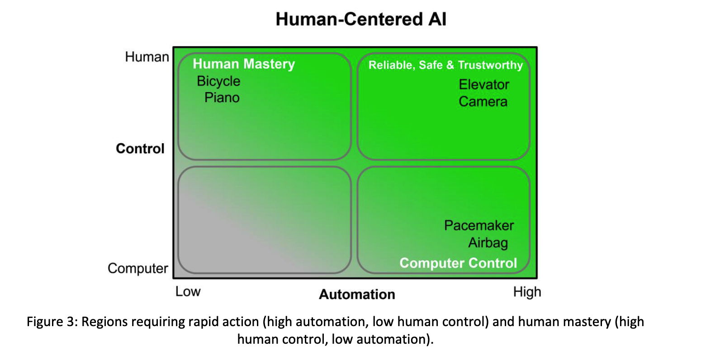
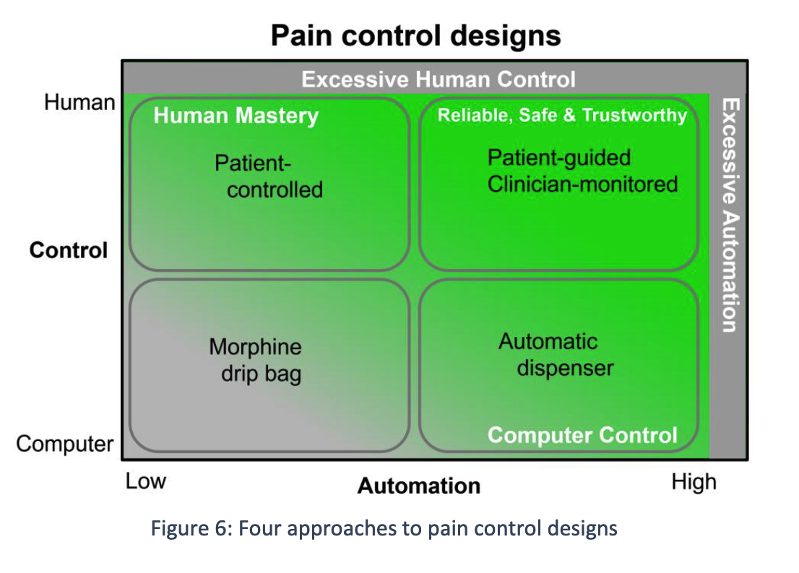
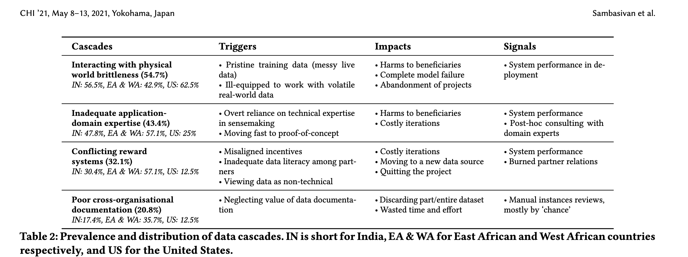

<style>
  @import './styles/auto-resize.css';
</style>


# Week 3: Human-centered and Data-centric Machine Learning 

About: This deck contains lecture content for Jan 21, 2025.

---


# Agenda

- Course logistics
- Questions
- Upcoming readings
- Week 3 Readings content
- Quick intro to relevant concepts from other disciplines
- Activity: developing some running scenarios for the course

---


## Course logistics

- We'll have quiz 1 NEXT Thursday, Jan 30
- First quiz will also serve to test our logistics
- Format: submitted via CourSys. Take home and open notes. 24 hours to complete. Some MCQs, some short writing.
- each quiz is meant to provide some additonal structure to our very broad-ranging course
- heuristic I'll use: could you talk about the material in a job interview or research context?

---
class: auto-resize-slide
---

<div class="auto-resize-content">

## Two Questions

- How is data-centric AI or data-centric ML different just plain old AI or plain old ML? 
  - The DataPerf paper provides one way to answer that
  - Today's DCAI paper provides another
  - To expand, we might imagine a few *running scenarios* that will be useful throughout our course

</div>

---
class: auto-resize-slide
---

<div class="auto-resize-content">

## Running scenario 1: you're a startup founder!

- Let's imagine we're each the founder of an AI startup
- We're trying to build one specific product. Perhaps it's a movie recommender system, or computer vision system that looks at pictures of a fridge and suggests a recipe, or a domain-specific chatbot such as a medical assistant
- Core challenge of allocation resources

</div>

---

## A few ideas that try and cut across varied interests!

- ggGPT - A LLM that's broadly useful for a variety of sporting and entertainment-related tasks: simulating an NPC in a game, providing insight on sports strategies, etc.
- MedAssist - A chatbot for mental health support and medical advice (perhaps using multiple models)
- ForYouPlus - a better recommender system for a social media feed that combines news and other content

---

## How we might allocate resources

- Buy more compute (GPUs, cloud credits, etc)
- Hire more ML research scientists
- Hire more software engineers
- etc.

---

## Distinction

We can think of a sharp distinction between asking our research scientists to spend more time trying different neural network architectures vs. spending more double-checking that the training data is labeled well.

Or we could hire people to go into the world and get more data. etc.!

---

## HCAI and DCAI gives us additional options

Sometimes we do just need to buy more GPUs. Almost all the material in this course will help us explore the full set of options.

Part of the point of the DataPerf paper is to say that the ML field thus far has focused too much on trying different models instead of just hiring domain experts to double check your data.

This is in line with the HCML paper.

---

## Running scenario 2: You're a policymaker!

Here's a very broad question. Say we're trying to draft a new Act that will change how data can be collected or used. For instance, we might want to ask companies to make it easier for users to withhold data.

*What policy will maximize social welfare*

Ok, that's a big question. We'll return to it...

---

## These scenarios aren't too far off from "IRL" cases

- The most relevant one in the short term is, what do *I* do differently as a software engineer, data engineer, ML research scientist, etc.
- But the options are pretty general

---


- CEO example: is generally about organization decision-making
- a manager or IC faces the same kinds of trade-offs but with less individiual power
- Policymaker example: is generally about setting the "rules of engagement"
- a citizen or voter faces the same kinds of trade-offs but with (much) less individual power

---

- Understanding the HCAI and DCAI perspective on CEO-decision making will help anyone working in a product-focused org
- Understanding the HCAI and DCAI perspective on policymaker decision making will help anyone contributing to policy (i.e., anyone who votes)

---

# Readings


[Ben Shneiderman](https://en.wikipedia.org/wiki/Ben_Shneiderman) HCAI

Sambavisan et al. Data Cascades

Zha et al. Data-centric AI Perspectives piece

---

## HCAI

TLDR: Reliable, Safe & Trustworthy

- Reliable = practices that support human responsibility, fairness, explainability
- Safe = what you'd expect
- Trustworthy = trust based on oversight

"intuitive meaning of these terms should also be clear"

Fun fact: anyone notice the reference for systems that "support human responsibility"?


---

```
                   Human-Centered AI

        +-----------------+-----------------+
 High   |                 | Reliable, Safe  |
Human   |                 | & Trustworthy ▲ |
Control |                 |                 |
        +-----------------+-----------------+
        |                 |                 |
 Low    |                 |                 |
        |                 |                 |
        +-----------------+-----------------+
         Low                               High
              Computer Automation
```

---

## Examples in HCAI

- Lower stake: recsys 
  - search engine completion
- high stakes: medical prediction ("algorithmic hubris" - discuss)
- life critical: cars and pacemakers

Key concept: be able to reason about spectrum of "criticality". Don't need to use (or agree with) the exact taxonomy from the paper, though.

---

Let's look at the paper's figures together (alt-tab as needed).

## Fig 3



---

## Fig 6



---

## Data cascades

Key idea: be aware of "data cascades" concept and think about how it will affect your work!

Some other notes:
- exposure to qualitative research on data supply chains
- see connections w/ previous readings
- see Related Work (data in HCI, politics of data, data quality)
- A very serious take on the "haha, isn't like 90% of ML just cleaning CSV files and images?" meme
- Data and Global South (AI and extraction)


---




---

## Zha et al paper

The Zha paper gives us yet another model to describe the full "pipeline" of data. This will be a recurring theme, with some variations!

---

## Key ideas from Zha et al's DCAI

- high-level split of training data, eval data, maintenance
  - collection, labeling, preparation, reduction, augmentation is nice framing, IMO
- in vs. out of distribution
- data maintenance
  - is this HCI?

---

## Product perspective on this

- Worth noting that each of these steps typically requires some kind of feature, separate product, or partner
- Platforms to collect data
- Platforms to label data
- Employee with the job of preparing data (data engineer, probably)
- Employee with the job of reducing data (data scientist, probably)

---


## Sometimes lines between categories are blurry

- Is collection and labeling always so distinct?

---

# Quick intro to relevant interdisciplinary concents

Goal: just a "Wikipedia tier" exposure

We'll cover more specific aspects as needed.

Caveat: we all must endeavor to keep learning about these things, myself included! ^[There's a running joke about economists and CS folks in particular being guilty of reading the Wikipedia page from another discipline and assuming they know everything about it!]

---

## Externality

- https://en.wikipedia.org/wiki/Externality
- aka external cost
- "indirect cost or benefit to an uninvolved third party that arises as an effect of another party's (or parties') activity"
- classic example: air polution

---

## More on externalities

- can be positive or negative
- positive externality: somebody walking by our classroom hears a funny joke you cracked
- can depend on how you're defining the "parties" involved in a transaction ^[a recurring theme we'll see in HCAI and DCAI is the need to be very precise about how we define relevant agents, parties, rules of engagement]

---

## Externalities and AI

- many AI harms as probably best described as externalities
- generally AI developers, even those who aren't explicitly trying to be "human centered" put some effort into not explicitly harming their users. So the main people being harmed are outside the "user" category
- though there are exceptions (esp. government use of AI)

---

## Knowledge sharing

- On the positive side, some might argue that AI industry creates some *positive externalities*
- open source software
- search engines and LLMs, if done correctly, have the potential to increase access to knowledge
- recommender help cut through the noise
- genAI help when people have unequal access to resources to practice a language, etc. ^[One currently hot ethical debate centers around the use of genAI to help produce art vs. the use of genAI to help people write in their non-first language.]

---

## Market failure

- https://en.wikipedia.org/wiki/Market_failure
- "a situation in which the allocation of goods and services by a free market is not Pareto efficient, often leading to a net loss of economic value"
- interconnected with externalities

---

## Public Goods

- https://en.wikipedia.org/wiki/Public_goods
- "a good that is both non-excludable and non-rivalrous"
- wait a second, what are those?

---

## Non-excludable goods

- "the degree to which a good, service or resource can be limited to only paying customers"
- or, "the degree to which a supplier, producer or other managing body (e.g. a government) can prevent "free" consumption of a good"
- i.e., how easily can put a fence around this thing
- https://en.wikipedia.org/wiki/Excludability

---

## Non-rivalrous goods

- "the cost of providing it to a marginal (additional) individual is zero"
- i.e. when you use the thing does it stop me from using the thing
- https://en.wikipedia.org/wiki/Rivalry_(economics)

---

## Ok, back to public goods

- can be used by multiple people with no problems
- classic examples: knowledge and language, public parks, radio broadcast

---

## Club goods

- in between public and private
- aka quasi-public goods
- excludable but non-rivalrous (because they get congested at some point)
- classic examples: toll road, private park
- https://en.wikipedia.org/wiki/Club_good

---

## Public and Club Goods and AI, oh my?

- Data and AI outputs are typically seen as information, and therefore potentially public goods
- Data is naturally non-rival: very cheap to copy and share, in absence of data protection laws
- Data requires effort to exclude: you need to put up anti-scraping measures or threaten me with a lawsuit, or else I'll write a Python script to scrape your website (and then I can copy and share with everybody)

---

# Crash Course, Some Other Relevant Concepts

##  Norms
- "Normative sentences imply "ought-to" types of statements and assertions"
- https://en.wikipedia.org/wiki/Norm_(philosophy)

## Normative goals

- We might see this in some HCAI and Responsible AI work.
- In short, this relates to different views on how the world ought to be
- Data has a mix of normative preferences and descriptive preferences in it. Can cause all sorts of problems

---

## Positionality statement

- describe researchers personal position relative to a project
- often focused on group identity (sometimes controversials
- somewhat discipline dependent
- https://en.wikipedia.org/wiki/Positionality_statement

---

## Moral philosophy

- https://en.wikipedia.org/wiki/Ethics
- try to answer normative questions about what is morally right

---

## Moral philosophy and AI

- A lot of questions about what kinds of AI systems are morally better than others, and what kinds of processes are morally better than other, are basically part of HCAI
- HCAI often requires a more explicit moral stance than "pre-HCAI" ^[Many people have been talking about HCAI relevant concepts since the inception of computing, to be clear!]
- but note this is because the values in "pre-HCAI" are some kind of rationalist epistemology

---


## Epistemology?

- https://en.wikipedia.org/wiki/Epistemology
- https://plato.stanford.edu/entries/epistemology/
- What is knowledge, how do we know if we have knowledge?

---

## One example of being specific about moral analysis

- https://dl.acm.org/doi/abs/10.1145/3531146.3533245
- Is calibration a fairness requirement?: An argument from the point of view of moral philosophy and decision theory, Loi and Heitz
- "For any thorough moral analysis, the meaning of the term “fairness” has to be made explicit and defined properly. For our paper, we equate fairness with (non-)discrimination, which is a legitimate understanding in the discussion about group fairness. More specifically, we equate it with “prima facie wrongful discrimination” in the sense this is used in Prof. Lippert-Rasmussen's treatment of this definition"

---

# Activity: Co-writing our running examples (and moving towards a unified definition of HCAI and DCAI)

Let's say we're going to write up a short sort of "simulation" or "game". We our two scenarios (start up founder and policymaker). We want to define all the actions available to them. Let's use our readings thus far and then get started on the next set of readings.

---

## Prompts

Prompt: what are distinct actions our CEO agent might take to improve their ML product

Prompt: what are distinct actions regulators might take to maximize the positive impact of AI on society? Which might be seen as "human-centered" and which might be seen as supporting "data-centered" AI


## Goal:

Try to describe actions very precisely and succintly so that we can turn them into Python code for some kind of simulation environment.


## 

- in person: describe "GridWorld", agent-based modeling, etc.
- pros and cons of social simulation