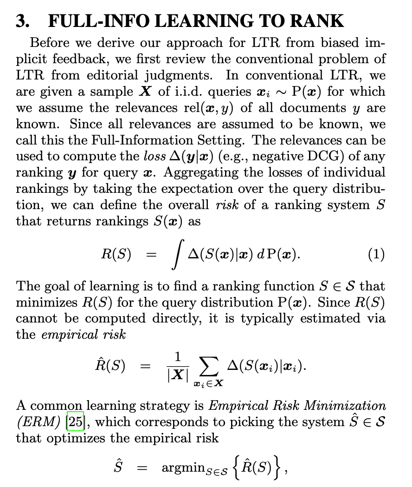
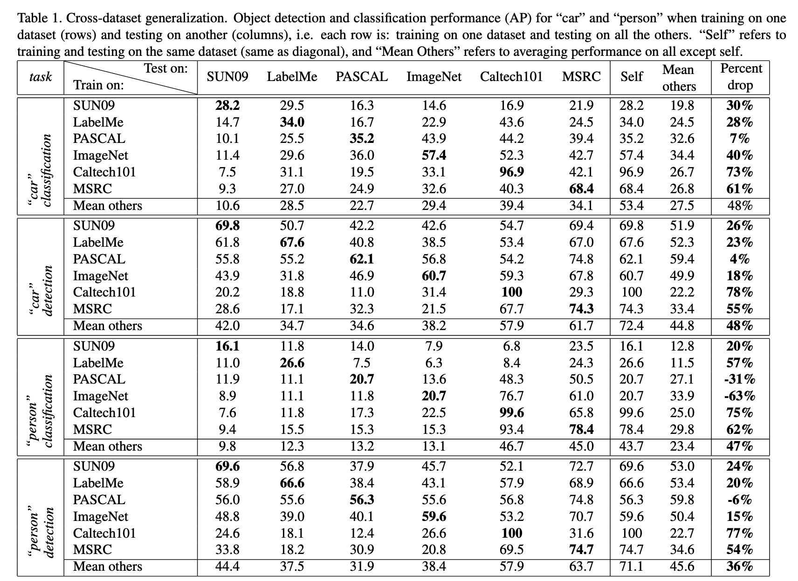

# Week 4: Fairness and HCAI

---

Ideas that have come up:

- one way to specifically instantiate human-centered AI is to select some human values (such as a particular notion of fairness) 
- and then change some part of the "AI Pipeline" so it better aligns with that values


---

## TLDR, we can start to make claims along the lines of "Project A is more human-centered than Project B because of alignment with this set of values"

- we might disagree with each toher

---

## Value-Sensitive Algorithm Design

- try to get tacit knowledge, insights, and *values* from 'relevant stakeholders'
- these will influence the actual algorithm choice
- value here = 'what a person or group of people consider important in life' (not the only def'n.)

---

## Ideas inpsiring VSAD

- user-centered design
- value sensitive design
- participatory design 
- We won't read about these in this course, but useful to know that all these big ideas we're seeing are themselves building on 3+ big ideas!

---

## Tiny Bit of History:

- user-centered design: 1970s, UCSD, Don Norman
  - Not really computing focused at all!
- value sensitive design: 1908s, UW, Batya Friedman and Peter Kahn
  - More grounded in computing and HCI
  - Batya Friedman also cited in FairML Intro: Friedman, Batya, and Helen Nissenbaum. “Bias in Computer Systems.” ACM Transactions on Information Systems (TOIS) 14, no. 3 (1996): 330–47. 
- participatory design / cooperative design: 1970s, Scandinavia
  - Big influence on some branches of computing work 

All have pretty specific processes and if you say you're using one in a paper, you may have to defend it! 

---


## FairML Intro 

Provides a number of ideas that might be seen as HCAI (though doesn't explicitly say so)

---

Peak at technical work cited

Joachims, Thorsten, Adith Swaminathan, and Tobias Schnabel. “Unbiased Learning-to-Rank with Biased Feedback.” In Proc. 1010Th International Conference on Web Search and Data Mining, 781–89. ACM, 2017. 





---

Summary of screenshot from Joachims, Swaminathan, and Schnabel paper:

- We want to rank items based on relevance
- Assume we have ground-truth relevance labels
- query x and documents y
- rel(x,y) gives relevance, Δ(y∣x) gives loss, could be NDCG
- R(s) is risk, gives loss over all queries
- Need to use empirical risk, approximated using sample
- Empirical risk minimization - do best we can for sample

---

But, "when using implicit feedback as a relevance sig-
nal, unobserved feedback is an even greater problem than
missing judgments in the pooling setting. In particular, im-
plicit feedback is distorted by presentation bias, and it is
not missing completely at random"

(This is just to start providing some examples of specific tasks!)

---

Torralba, Antonio, and Alexei A Efros. “Unbiased Look at Dataset Bias.” In Proc. CVPR, 1521–28. IEEE, 2011. 




---

Zhang, Junzhe, and Elias Bareinboim. “Fairness in Decision-Making — the Causal Explanation Formula.” In Proc. 3232Nd AAAI, 2018. 

 B
    B[Data] --> C
    C[Model] --> D
    D[Subjects of Model] --> A
```

---

## State of the world

Is messy, ultra high dimensional, and thus complicated to capture.

---

## Measurement: From state of the world to data

But we can take some kind of measurements to get something that looks like a spreadsheet or a stack of images or a big blob of text documents. All of which serves as...

---


## Data

- Data is some dimensionally reduced, simplified representation of the state of the world
- Key idea: "training data is constructed", via measurement process, with its own subjective processes and technical difficulties
  - Example from reading: addition of "multiracial" box on survey
- Key idea: subjective decisions and technical challenges pop up when dealing cameras and surveys (both sensors and forms)

---

## Learning: from data to model

We use some kind of learning algorithm (a set of instructions) to 'learn' a model from our given data set. Might be supervised or not.

---

## Model

Model 'summarizes patterns in the training data'^[FairML, Intro]. Might describe as 'compression'.

---

## Predictions: From model to subjects

Model produces (misleadingly named) 'predictions', which are really more of classifications or detections in most cases (real prediction must be time-dependent!)

---

## What do we do with our 'predictions'

These might be used to change an organization's decision (who gets a loan, who gets investigated). Then the outcomes of these actions change the state of the world!

---

## Bringing it back to HCAI broadly

The machine learning *loop* approach suggests there's perhaps 8 distinct "entry points" in which we could try to intervene to achieve some human-centered goal (and several of those places are explicitly data-centered...)

---


- change the world
- change how measurements are made
- change the data after it's measured (isn't that just data fraud?)
- change the learning process
- change the model after it's learned
- change how model inferences are output (this one's probably the most iffy)
- change how predictions are used by people

---

## Some discussion questions about the loop, as time permits

- Can *we* really operate on "the state of society?"
- How do we most effectively operate on data?
- How do we most effeectively operate on models


---

## Activity

Using the ML Learning Loop to Situate All of Our Readings thus far: different entry points into an ML system (and we shouldn't forget the "meta" point of "don't use ML", i.e., get rid of the system)

---

## The Practices of HCML and the Loop

- "Ensure ML is the right solution and approach to take" suggests not setting up a loop
- "Acknowledge ML problem statements take positions" suggests modeler positionality - may affect the learning, may affected how predictions are used
- "Move beyond users and interaction as the definition of human" could change measurement
- "Legitimize domain contributions/collaborations as field priorities" will definitely change measurement
- "Design HCML anticipating and iterating on sociotechnical failure" focuses on how predictions act on people

---

## Data-centric AI article and the Loop

- Very much about measurement!

---

## DataPerf and the Loop

- Not just about measurement... it's about operating on the actual data (in ways that don't constitute something like scientific fraud)

---

## Data Cascades

- Very much about measurement errors and how they, well, cascade...

---

## Schneiderman's HCAI

- Some aspects of measurement
- but also deeply concerned with "predictions" acting in the world

---

## We can start to stitch together a picture of HCAI and DCAI