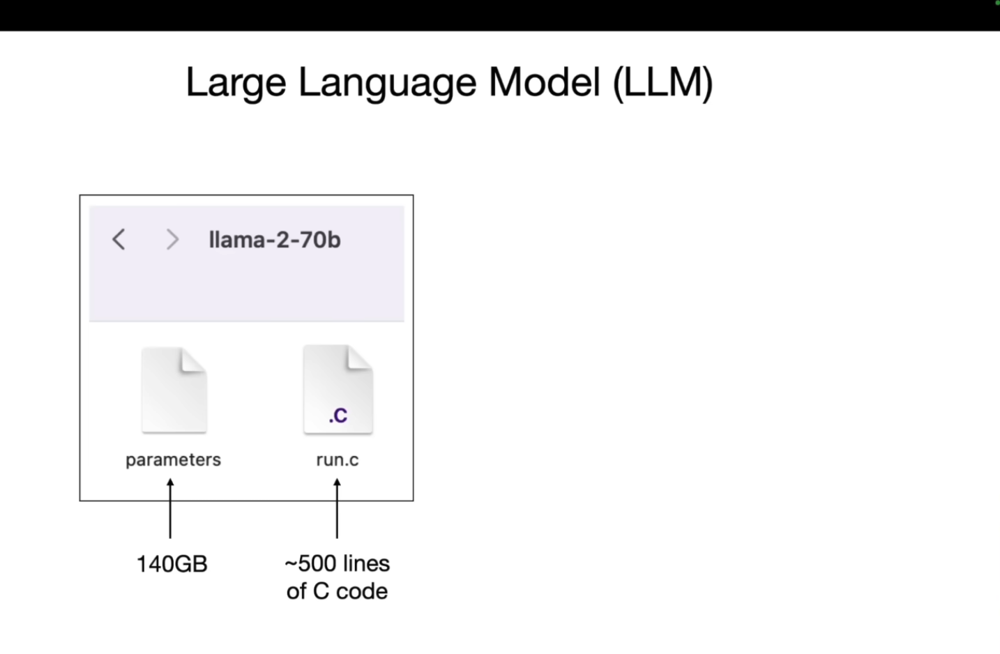
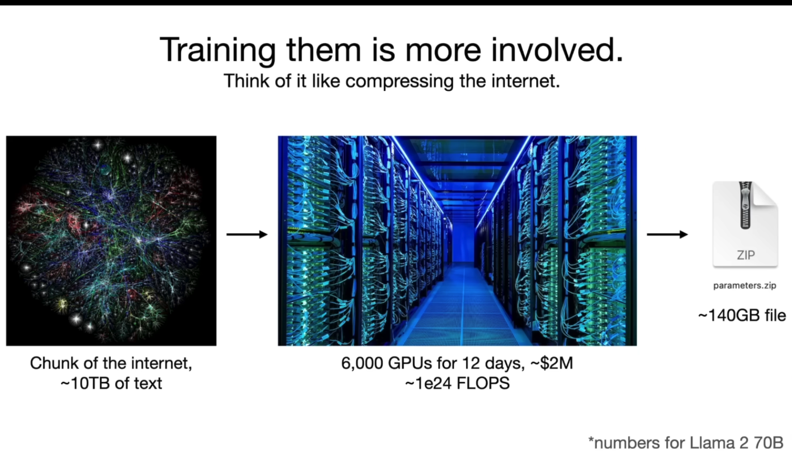
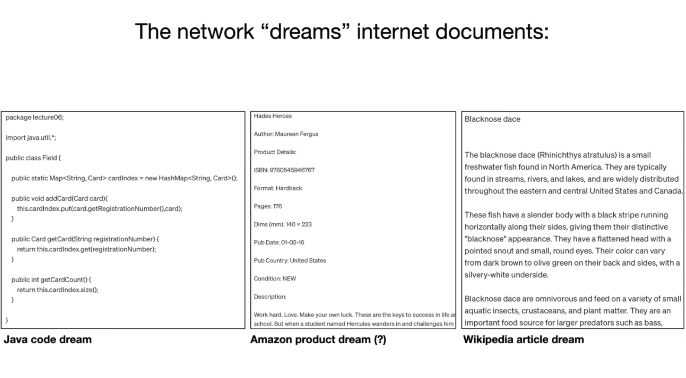
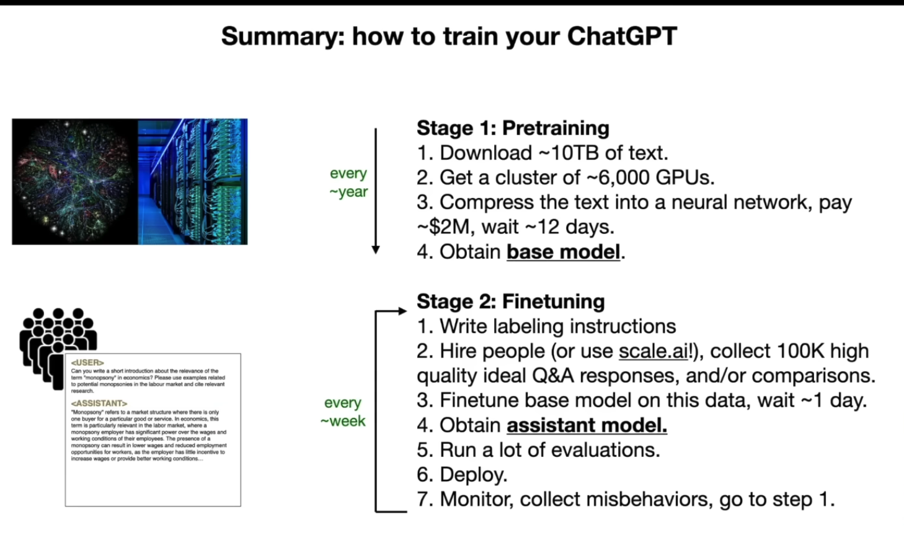

## About this lecture

- Goal is to integrate the Intro to LLMs (Karpathy's video + several linked slide decks) with our LLM-data related readings and examples (Pile, RefinedWeb, blog posts on the topic)
- [Video](https://www.youtube.com/watch?v=zjkBMFhNj_g)

<!-- end_slide -->

## See also

- Thom Wolf (HuggingFace), "A little guide to building Large Language Models
in 2024": [link](https://docs.google.com/presentation/d/1IkzESdOwdmwvPxIELYJi8--K3EZ98_cL6c5ZcLKSyVg/edit#slide=id.g2c144c77cfe_0_76)
- Graham Neubig (CMU), "Tour of Modern LLMs (and surrounding topics": [link](https://phontron.com/class/anlp2024/assets/slides/anlp-15-tourofllms.pdf)

<!-- end_slide -->

## Karpathy's "Two files" mental model

- parameters (2 bytes for a float16 per param -> 140 GB for a 70B param model)
- run.c (notes its 500 lines of C code!)
---

<!-- end_slide -->

## A few useful tidbits

- Getting a sense of the file sizes can be useful
- Note the point about 7B being about 10x slower (linear) than 70B

<!-- end_slide -->

## More useful order of magnitude figures

For 140GB 70B params "file":

- 10 TB of text "chunk of the Internet"
- 6,000 GPUs for 12 days, costing about 2M USD (2.7M CAD)
- 1e24 FLOPs. That's 10 to the 24th!

Quick question: What's the compression ratio?

<!-- end_slide -->

<!-- end_slide -->

## Lossy compression

"Gestalt" of the actual knowledge / content

<!-- end_slide -->

## What about prod systems

- About 10x in size (when this video came out!!!)
- 10M or 100M dollars for training run (imagine being the person to enter `train.py`...)

<!-- end_slide -->

## About the predictions

- It's "just" a Neural Network!
- "dream" metaphor. Every output is a "dream"?
- it won't parrot documents? How do we square this with copyright lawsuits?

<!-- end_slide -->

## Transformer architecture

- We know all the math, we can write it down
- But all we do as humans is to adjust the parameters to get better "next word"
- mechanistic interpretability (what are the parts doing?)
- weird one dimensional aspects to "knowledge" (e.g. Mother <> Son)
- hand-waving much of the implementation details for now (see longer 2 hour video, https://www.youtube.com/watch?v=kCc8FmEb1nY&t=57s)

<!-- end_slide -->

## LLM as "empirical artifacts"

- More like social science or physical science than (some fields) of computing science
- Not a lot of theory to explain things yet!

<!-- end_slide -->

<!-- end_slide -->

## Assistant Models

- Just add a new dataset with labeling instructions
- People ask questions and answer them
- There's a bunch of secret troves of documents somewhere of "fake" conversations that look like ChatGPT conversations!
- fine tune on this "assistance dataset", typically
- called RLHF

<!-- end_slide -->

## Timelines

Karpathy gives us the heuristic that pretraining is about once a year and finetuning can be once a week

- recall: 10 TB text, 6000 GPUs costing 2M USD over 12 days
- new info: about 100K high quality "ideal" Q&A responses and comparisons of responses
- finetune might take one day
- (note that various online communities have created finetuned models for various purposes)

<!-- end_slide -->

## Responses vs Candidates

- from labeling perspective, it's quicker to pick between a few options vs. write something from scratch
- finetuning on comparions is implemented a bit differently than 

<!-- end_slide -->

## Using models to label?

- LLM creates a draft and people select from it...
- can do labeling that's more "machine labeled"
- Implications?

<!-- end_slide -->

## Chatbot Arena

- ELO rating
- You can play this today!
- Any problems with this?

<!-- end_slide -->

## More on scaling laws

- We can predict performance based on number of params, amount of text (N for number of params here, D for amount of data)
- We're not in the flat zone yet!
- Next word prediction accuracy is correlated with other texts
- So everyone assumes training on more data or with more params will get better "general capabilities"

<!-- end_slide -->

## Example capabilities

- Example of ChatGPT using web browser, running code, passing query to text-to-image
- How could we build our own search on top of an open LLM. Any ideas?
- Other thoughts on current LLM *product* tool use?

<!-- end_slide -->

Are we at the ceiling/wall? Ilya's 2024 NeurIPS talk: https://www.youtube.com/watch?v=1yvBqasHLZs

<!-- end_slide -->

## System 1 and 2

- "fast and slow"
- metaphor: LLMs only have system 1, no system 2
- How can convert time into accuracy?
- Question: How can you do this right now?

<!-- end_slide -->

## Self-improvement

- Example of Go
- Basic idea: is if you have a simple reward function that says "was the thing good or bad" we can just use that reward
- What are contexts might work here?
- Interesting semi-example: Dota 2

<!-- end_slide -->

## Karpathy's vision of LLM OS

- What did you think about this? 
- Do you want this on your laptop? Your phone? A local cluster in the school library?

<!-- end_slide -->

## "Jailbreaks"

- How to get ChatGPT to tell us how to manufacture napalm through "roleplay"
- Active research area on "jailbreak attacks"
- Role play scenarios, base64 encoding, "universal transferable suffix"
- generally about bypassing system guardrails
- one human's jailbreak is another human's preferred behavior!

<!-- end_slide -->

## Other attacks

- white image with faint text (classic resume hack)
- prompt injection attacks from a web page
- security knowledge will certainly remain relevant in post-LLM world :)

<!-- end_slide -->

## Data poisoning

- "trigger phrase" in a spy movie
- we can do this to LLMs?

<!-- end_slide -->

## A few other perspectives

Thom Wolf's "stages of data training"

- Pretraining -> instruction tuning -> alignment -> in-context learning -> task-specific fine-tuning
- Suggestion: just pull up the [slides](https://docs.google.com/presentation/d/1IkzESdOwdmwvPxIELYJi8--K3EZ98_cL6c5ZcLKSyVg/edit#slide=id.g2c144c77cfe_0_76) here

<!-- end_slide -->

Yi's data cleaning pipeline

- Language filtering -> Text Metric filtering
- -> Repetitive Document Removal -> Rule Based Correction
- -> Perplexity filtering -> Document Quality Filtering 
- -> Paragraph deduplication -> MinHash Deduplication
- -> Exact Deduplication -> Semantic, topic, and safety filtering

(Main point here is just the potential for *many* steps)

<!-- end_slide -->

## Quality filtering with heuristics

- We might want to filter based on... word count, repetition, certain patterns in a document, various ratios (all caps), general descriptive stats
- This involves a lot of design decisions, however! Tough to do in a principled way
- See the full deck for lots of implementation details

<!-- end_slide -->

## Back to the data...

- So we're all on the same page of the high-level overview of how LLMs work

<!-- end_slide -->

## Looking back to 2020

- We had info about GPT-3 training data
- WebText (Reddit links with 3 or more karma), Wikipedia, Books (mystery), Common Crawl
- "there's already voting going on!"

<!-- end_slide -->

## InstructGPT in 2022

- InstructGPT (a precursor of modern ChatGPT model) has a model card with info about scraped data and human labelers
- Similar to 2020
- Also... Twitter was in the training data for some portion of time?

<!-- end_slide -->

## Important note: the role "of high quality filters"

- Blog notes that "so whoever contributed high-quality content to said reference corpora is likely playing an amplified role"
- This can really skew the relative weights of different people
- Critical open research question: system-level data valuation

<!-- end_slide -->

## Pre-training vs. Fine-tuning data

What's the difference between ideal pre-training and fine-tuning data?

<!-- end_slide -->

## Applying it to your interests

- What's the best data source for your need?
- What data do you want avoid?
- For your discussion section: What data do you want to have available in 5 years?