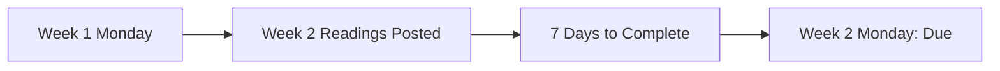
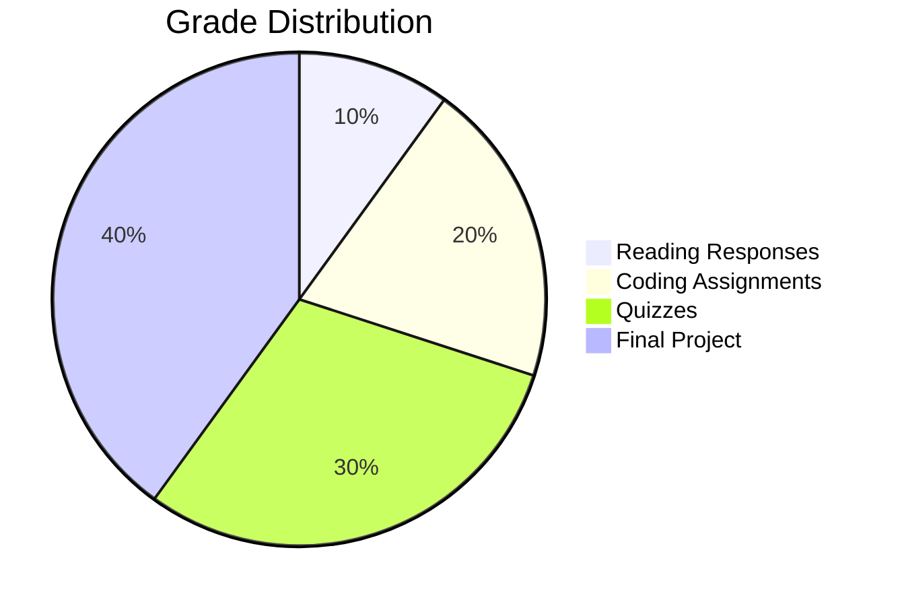

# Week 1, Day 1: The Syllabus Deck
First draft: Jan 2. Final draft: Jan 6

<div class="pt-12">
  <span class="px-2 py-1">
    Press Space for next slide
  </span>
</div>

---
layout: section
---

# Course Structure

---
layout: two-cols
---

# Lecture Schedule

::right::

- **Tuesdays (1hr)**
  - Discuss previous week's readings
  - Introduce new materials
  - Assignment overview

- **Thursdays (2hr)**
  - Traditional lecture (1hr)
  - Class activity (1hr)
  - Quizzes & practice work

---
layout: center
---

# Communication Policy

- Questions at start/end of each session
- Email response: 2-3 business days
- Prefer in-class questions for:
  - Faster responses
  - Benefit to all students

---
layout: section
---

# Reading Components

---

# Reading Structure

- **Mandatory Readings**
  - Core course material
  - Weekly responses required

- **Optional Readings**
  - Theme-organized
  - Read abstracts/intros
  - Aligned with your interests

::right::

<div class="border-l-4 pl-4 border-blue-500">
Note: AI assistance discouraged for readings. Bullet points preferred over LLM-generated text.
</div>

---

# Reading Schedule

<div class="grid grid-cols-2 gap-4">

<div>
<h3>Timeline</h3>

- Finalized Monday of Week X-1
- Complete by Monday of Week X
- Responses due before class
</div>

<div>
<h3>Example</h3>


</div>

</div>

---
layout: section
---

# Course Modules

---

# Course Organization

<div class="grid grid-cols-2 gap-4">

<div>
<h3>Module 1 (Weeks 1-4)</h3>
Administration and Introduction to Human-Centered/Data-Centered Frameworks

<h3>Module 2 (Weeks 5-7)</h3>
Technical work in Data Valuation and Scaling

</div>

<div>
<h3>Module 3 (Weeks 8-10)</h3>
Online platforms and Content Ecosystems

<h3>Module 4 (Weeks 11-13)</h3>
Frontiers in Data Governance: Voting, Markets, and More

</div>

</div>

---
layout: section
---

# Grading Structure

---

# Grade Breakdown



---
layout: section
---

# Course FAQs

---
layout: fact
---

# Attendance

- Not directly graded
- Participation expected
- Cold-calling for reading responses
- Stay home when sick
- No need to email for absences

---

# Coding & Tools

- Python for ML/Data Science
- JavaScript for web programming
- LLM assistance allowed (with caveats)
- Free tools always available
- 4 assignments + 1 project

---

# Group Work Policy

- Opportunities available
- Contribution statements required
- Code/writing review mandatory
- Specific guidelines per assignment

---

# Assessment Structure

- 4 module quizzes
- No midterm/final
- In-class format
- Make-up options available
- Based on lectures & mandatory readings

---
layout: center
---

# AI Tool Usage

<div class="grid grid-cols-2 gap-4">

<div>
<h3>Allowed with:</h3>

- Complete logs
- Clear attribution
- Proper documentation
</div>

<div>
<h3>Example Citations:</h3>

- "Produced by model XYZ"
- "Generated with ChatGPT"
- "AI-assisted, heavily edited"
</div>

</div>

---
layout: center
---

Example:

I generated this deck by first manually writing a draft of the syllabus as syllabus.md

Then I provided this markdown file to Claude Sonnet 3.5 with prompt:

```
Convert this md file to a nice, snazzy, cool, sli.dev presentation

It should be titled "Week 1, Day: The Syllabus Deck".
```

---
layout: end
---

# Questions?

Feel free to ask now or after class!